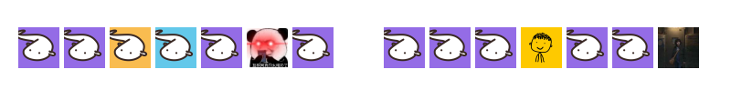

### Hi I'm Versun 👋

- Blog: [versun.me](https://versun.me) / [RSS](https://versun.me/feed)
- Email: github#verun.me
- Telegram: [Versun Pan](https://t.me/versunpan)
- Mastodon: [@versun@versun.me](https://versun.me/@versun)
- Twitter: [@versunpan](https://x.com/VersunPan)

### Projects

**进行中**
- [ShareThis.Chat](https://sharethis.chat/)：AI 聊天分享器
- [Rables](https://github.com/versun/Rables)：本博客所使用的 CMS，使用 Rails 框架编写

**旧项目**
- [neon-swarm](https://github.com/versun/neon-swarm)：霓虹蜂群 — 多人实时在线太空射击游戏
- [comicforge](https://github.com/versun/comicforge)：漫画分镜生成器
- [orbit](https://github.com/versun/orbit)：以拟态（Claymorphism）风格呈现的实时太阳系模拟网站
- [星座运势](https://github.com/versun/xzys)：从星座运势文章中自动提取结构化信息，生成可导出的日历表格数据
- [asuka-tiny-home](https://github.com/versun/asuka-tiny-home)：A tiny-world home for Asuka Langley Soryu, built from Jason Kneen's Tiny World Builder
- [Send](https://github.com/versun/send)：匿名文件分享器
- [Clip](https://github.com/versun/clip)（[clip.versun.me](https://clip.versun.me/)）：极简匿名 Pastebin 文本分享器
- [LKS](https://github.com/versun/LKS/)（[lks.versun.me](https://lks.versun.me)）：可匿名使用的短链接生成器
- [RSS Box](https://github.com/versun/RSSBox)（[rssbox.app](https://rssbox.app)）：开源、简洁、可自部署的 RSS 翻译器
- [54321周刊](https://54321.versun.me/)：每周六分享科技趣闻
- [SponsorGen](https://github.com/versun/sponsorgen)：一个基于 Go 的动态赞助者图片生成工具，支持多平台赞助数据聚合与展示
- [aicmt](https://github.com/versun/aicmt)：一个 AI 驱动的 Git 提交助手，不仅能自动生成提交信息，还能自动分析代码变更，并根据最佳实践将其拆分为多个结构良好的提交
- [feed2json](https://github.com/versun/feed2json)：A Python package for convert RSS feed to JSON Feed
- [easytranslator](https://github.com/versun/easytranslator)：A Python package for reliable text translation using multiple free engines with automatic failover
- [Pinboard To BookmarksBar](https://github.com/versun/Pinboard-To-BookmarksBar)：A browser extension that import bookmarks from Pinboard into your browser's bookmarks bar
- [Tiny Website](https://github.com/versun/Tiny-Website/)

### A Big Thank You to My Sponsors
I am deeply grateful to my amazing supporters and sponsors who have made my open source journey possible.
<table>
  <tr>
    <td style="padding:10px;">
      
    </td>
  </tr>
</table>

Additional Sponsors
- YYYoung
- piglei
- 大核桃

Become a Sponser on [Github](https://github.com/sponsors/versun) / [爱发电](https://ifdian.net/@versun) / [微信](https://versun.me/wechat.jpg)

Sponsor image generated by [SponsorGen](https://github.com/versun/sponsorgen)
