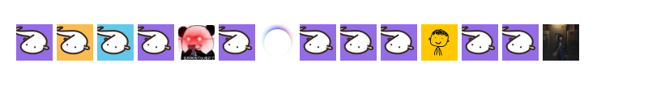

### Hi I'm Versun 👋

- Blog: [versun.me](https://versun.me) / [RSS](https://versun.me/feed)
- Email: github#verun.me
- Telegram: [Versun Pan](https://t.me/versunpan)
- Mastodon: [@versun@versun.me](https://versun.me/@versun)
- Twitter: [@versunpan](https://x.com/VersunPan)

### A Big Thank You to My Sponsors
I am deeply grateful to my amazing supporters and sponsors who have made my open source journey possible.
<table>
  <tr>
    <td style="padding:10px;">
      
    </td>
    <td style="padding:10px;">
      
    </td>
  </tr>
</table>

Additional Sponsors
- YYYoung
- piglei
- 大核桃

Become a Sponser on [Github](https://github.com/sponsors/versun) / [爱发电](https://afdian.com/@versun) / [微信](https://versun.me/wechat.jpg)

Sponsor image generated by [SponsorGen](https://github.com/versun/sponsorgen)
